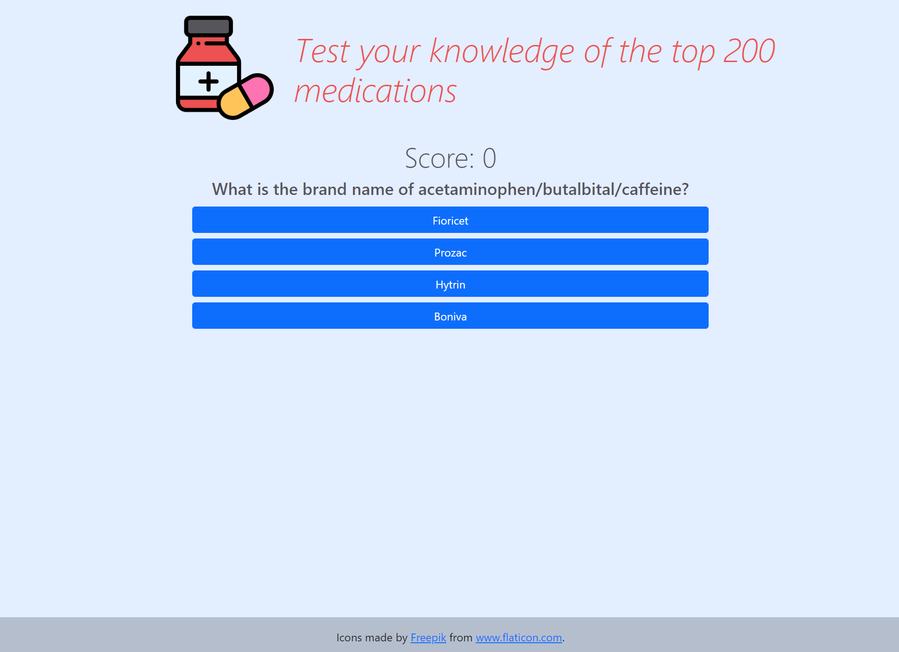

# Top 200 Brand / Generic Web Application Quiz

## https://top200quiz.calebdunn.tech

## Created with create-react-app

### Run local
1. Clone repository
2. Navigate to cloned folder
3. Perform `npm install`
4. Run `npm start`
5. Access at `localhost:3000` if using default parameters